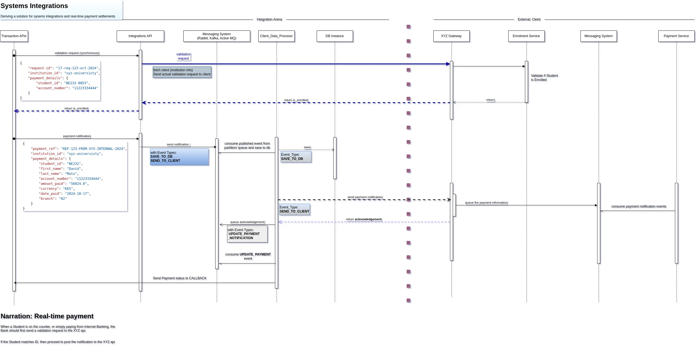

#### XYZ Integration

Featuring microservice architecture, this project demonstrates how integration between disparate systems can be made seamless. 

The project is based on Spring Boot 3.3, features application messaging (using __Rabbit__) to provide resilience againsts failures, caching (using __Redis__) 
to improve performance and reduce database walks for static data, and database migration (using __Flyway__) to facilitate database staging.

___

#### The Architecture



Going with the requirement, the client end will be developed, then have a mock (basic) API to represent the Bank sending ``validation`` and ``payment notification`` to XYZ Gateway API

> The old narrative has been moved to file [README_old_narrative.md](./README_old_narrative.md) to keep this page concise.


#### Data Strucures

Database Structures:

1. XYZ University Services 
These support the core APis for XYZ University


* __``enrolment``__

Facilitates Student validation to aid verdict on posting payment notification 


```sql
+----------------+--------------+------+-----+---------+-------+
| Field          | Type         | Null | Key | Default | Extra |
+----------------+--------------+------+-----+---------+-------+
| STUDENT_ID     | varchar(200) | NO   | PRI | NULL    |       |
| FIRST_NAME     | varchar(25)  | YES  |     | NULL    |       |
| LAST_NAME      | varchar(45)  | YES  |     | NULL    |       |
| ACCOUNT_NUMBER | varchar(200) | YES  |     | NULL    |       |
| STATUS         | varchar(45)  | YES  |     | NULL    |       |
+----------------+--------------+------+-----+---------+-------+
```

* __``payments``__

Persists Payment notifications from the bank

```sql
+--------------------+--------------+------+-----+---------+-------+
| Field              | Type         | Null | Key | Default | Extra |
+--------------------+--------------+------+-----+---------+-------+
| PAYMENT_ID         | varchar(255) | NO   | PRI | NULL    |       |
| EXTERNAL_REFERENCE | varchar(255) | YES  |     | NULL    |       |
| FOR_INVOICE_ID     | varchar(50)  | YES  |     | NULL    |       |
| STUDENT_ID         | varchar(50)  | YES  |     | NULL    |       |
| AMOUNT_PAID        | double       | YES  |     | NULL    |       |
| DATE_PAID          | datetime     | YES  |     | NULL    |       |
| WALLET             | varchar(50)  | YES  |     | NULL    |       |
| COMMENT            | text         | YES  |     | NULL    |       |
+--------------------+--------------+------+-----+---------+-------+
```


2. Banking Services
* __bank_clients__
```sql
+-------------------------+--------------+------+-----+---------+-------+
| Field                   | Type         | Null | Key | Default | Extra |
+-------------------------+--------------+------+-----+---------+-------+
| CLIENT_ID               | varchar(255) | NO   | PRI | NULL    |       |
| INSTITUTION_NAME        | varchar(255) | YES  |     | NULL    |       |
| VALIDATION_ENDPOINT     | varchar(255) | YES  |     | NULL    |       |
| PAYMENT_NOTIFICATION_EP | varchar(255) | YES  |     | NULL    |       |
+-------------------------+--------------+------+-----+---------+-------+
```


* __payment_notifications__
```sql
+--------------------------+--------------+------+-----+---------+-------+
| Field                    | Type         | Null | Key | Default | Extra |
+--------------------------+--------------+------+-----+---------+-------+
| NOTIFICATION_ID          | varchar(255) | NO   | PRI | NULL    |       |
| CLIENT_CALLBACK_URL      | varchar(255) | NO   |     | NULL    |       |
| CLIENT_ID                | varchar(255) | YES  |     | NULL    |       |
| PAYMENT_BODY             | json         | YES  |     | NULL    |       |
| QUEUED_AT                | datetime     | YES  |     | NULL    |       |
| IS_SENT                  | int          | YES  |     | NULL    |       |
| SENT_AT                  | datetime     | YES  |     | NULL    |       |
| IS_ACKNOWLEDGED          | int          | YES  |     | NULL    |       |
| ACKNOWLEDGEMENT_RESPONSE | text         | YES  |     | NULL    |       |
| SEND_COUNT               | int          | YES  |     | NULL    |       |
| COMMENT_LOG              | text         | YES  |     | NULL    |       |
+--------------------------+--------------+------+-----+---------+-------+
```


#### Services
All the services are bundled as a single project for simplicity and portability, capable of spinning up an entire landscape of services on __Docker__

Using Docker compose, the services can be brought up altogether.

* __Bank Services__
Sends _Student Validation_ and _Payment notification_ requests to the Gateway services of Xyz apis

 
* __Enrolment Service__  (xyz)
A core service that hosts student enrolment and serves _Student Validation_ to the Gateway API


* __Payment Service__    (xyz)
A core service that serves to persist payment notifications received at the gateway. This API consumes message from queue to save to database


* __Gateway Service__    (xyz)
Responsible for hiding the core services for Xyz such that only desired APIs can interact with the external clients. Security will be implemented here.


#### Running the services
This is a Gradle-built project that runs on Docker swarm.
> No need to install Gradle, the project comes with a Gradle wrapper.


1. Fork the project 
```sh 
git clone https://github.com/david-matu/xyz_integration_demo.git

cd xyz_integration_demo

./gradlew build && docker compose build && docker compose up -d
```

You should see logs like these after successful startup:
```sh
✔ Container xyz_services_integrated-rabbitmq-1               Healthy                                                                                                                                                                   11.5s 
 ✔ Container xyz_services_integrated-bank_mysql-1             Healthy                                                                                                                                                                   12.3s 
 ✔ Container xyz_services_integrated-mysql-1                  Healthy                                                                                                                                                                   10.8s 
 ✔ Container xyz_services_integrated-xyz-payment-service-1    Started                                                                                                                                                                   11.0s 
 ✔ Container xyz_services_integrated-xyz-enrolment-service-1  Started                                                                                                                                                                   11.0s 
 ✔ Container xyz_services_integrated-xyz-gateway-service-1    Started                                                                                                                                                                   11.8s 
 ✔ Container xyz_services_integrated-bank-service-1 
 
```

#### API Documentation
After the services are up, access the documentation on the browser at:

[http://localhost:9000/openapi/swagger-ui.html](http://localhost:9000/openapi/swagger-ui.html)

For core services:
* __Bank Service__
[localhost:9090/openapi/swagger-ui.html](http://localhost:9090/openapi/swagger-ui.html)

* _xyz gateway service_
[http://localhost:9000/openapi/swagger-ui.html](http://localhost:9000/openapi/swagger-ui.html)

* __xyz enrolment service__
[http://localhost:9001/xyz-core/openapi/webjars/swagger-ui/index.html#/](http://localhost:9001/xyz-core/openapi/swagger-ui.index.html) 


#### Monitoring Events in Rabbit MQ
Navigate to the following link to monitor messages: [http://localhost:15672/](http://localhost:15672/)

#### Logs from Nodes:
In advanced stage of this project, the logs can be shipped to `ELK`. At the moment, for simplicity, we can monitor logs per node on the terminal like so:

In the project root directory:
```sh
# Append -f flag to display them as they happen 
docker compose logs xyz-enrolment-service -f

docker compose logs xyz-payment-service -f

docker compose logs bank-service -f

docker compose logs xyz-gateway-service

docker compose logs mysql

docker compose logs rabbit
```
> Take note that the names are as they were baptised in the `docker-compose-file`


#### Monitoring
Nodes can be best monitored by services such as ``Prometheus`` and ``Grafana``, to show their health statuses.

At the moment, for simplicity reasons, the apis are equipped with a healthcheck capability 
which is aggregated by a selected api (on gateway) and returned as a single object showing how each service is faring

#### Interacting with the Nodes: databases, Rabbit, microservices:

For each of the instances, ensure you are in the project's root directory (where ```docker-compose``` resides


__mysql__
```sh
docker compose exec mysql mysql -u david -p
docker compose exec bank_mysql mysql -u david -p

# Password will be prompted: enter david123
```  

